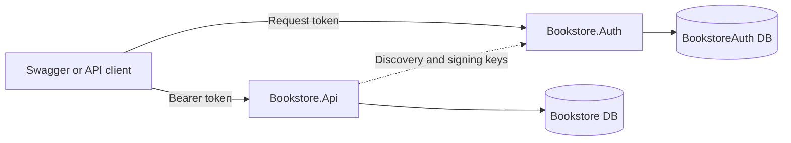

# Bookstore API

[](https://github.com/PetkovskiM/bookstore-api/actions/workflows/build-and-tests.yml)

An ASP.NET Core bookstore API with SQL Server persistence, an OpenIddict authorization server, and Swagger/OpenAPI documentation. Book CRUD uses OAuth 2.0 client credentials with `books.manage`; paginated title/author search uses the assignment-required implicit flow with `books.search`.

## Reviewer quick start

### Prerequisites

- Git
- Docker Desktop running Linux containers
- Windows PowerShell

A local .NET SDK, Visual Studio, User Secrets, and `dotnet dev-certs` are not required for the Docker demonstration.

### 1. Start the solution

From the repository root, start Docker Desktop and run these commands separately:

```powershell
powershell.exe -NoProfile -ExecutionPolicy Bypass -File scripts/Initialize-DockerDemo.ps1 -TrustHttpsCertificate
docker compose --profile demo config --quiet
docker compose --profile demo up -d --build --wait
docker compose --profile demo ps
```

The initializer creates ignored local configuration, random credentials, and HTTPS/OAuth certificates without printing secret values. The first build can take several minutes while Docker downloads images and restores packages.

The final command should show `sqlserver`, `auth`, and `api` as healthy.

### 2. Open the applications

| Address | Purpose |
| --- | --- |
| `https://localhost:7100/swagger` | Swagger demonstration UI |
| `https://localhost:7100/health` | API and Bookstore database health |
| `https://localhost:7200/` | Auth account, login, and logout |
| `https://localhost:7200/health` | Auth and authentication database health |
| `https://localhost:7200/.well-known/openid-configuration` | OAuth discovery document |

Both health endpoints should return `Healthy`. Before authorizing Swagger, call a protected endpoint to see the expected `401 Unauthorized` response.

## Try both authorization flows

Swagger exposes two independent authorization schemes:

| Swagger scheme | OAuth client | Flow and scope | Used for |
| --- | --- | --- | --- |
| **ManagementToken** | `bookstore-management` | Client credentials, `books.manage` | Book CRUD |
| **SearchOAuth** | `bookstore-browser` | Implicit, `books.search` | Paginated search |

The OAuth clients are applications, not users. The Development user who signs in for search is `demo@bookstore.local`.

### 3. ManagementToken: client credentials and CRUD

Run the following in PowerShell. It reads the generated client secret locally without displaying it. The final clipboard command copies only the access token.

```powershell
$authSettings = Get-Content -LiteralPath '.local/docker/auth.json' -Raw | ConvertFrom-Json

$managementToken = Invoke-RestMethod -Method Post -Uri 'https://localhost:7200/connect/token' -Body @{
    grant_type    = 'client_credentials'
    client_id     = 'bookstore-management'
    client_secret = $authSettings.'DevelopmentDemo:ManagementClientSecret'
    scope         = 'books.manage'
}

$managementHeaders = @{ Authorization = 'Bearer ' + $managementToken.access_token }
$managementToken.access_token | Set-Clipboard
$managementToken | Select-Object token_type, expires_in
```

The result should show a `Bearer` token with an approximately 900-second lifetime.

In Swagger:

1. Select **Authorize**.
2. Find **ManagementToken**.
3. Paste the clipboard value without adding a `Bearer ` prefix.
4. Select **Authorize**, then close the dialog.
5. Use **Try it out** to call `POST`, `GET`, `PUT`, and `DELETE /api/books` operations.

`POST` returns `201 Created`, database-generated book/author IDs, and a `Location` header. Keep one temporary book until after the persistence test below.

### 4. SearchOAuth: browser login and search

`bookstore-browser` is the public OAuth client ID; it is not the login username and has no client secret.

Copy the generated Development user password:

```powershell
(Get-Content -LiteralPath '.local/docker/auth.json' -Raw | ConvertFrom-Json).'DevelopmentDemo:UserPassword' | Set-Clipboard
```

In Swagger:

1. Select **Authorize** and then **SearchOAuth**.
2. Leave the prefilled client ID as `bookstore-browser`.
3. On the Auth login page, use username `demo@bookstore.local` and paste the clipboard password.
4. Sign in. The browser returns to Swagger's registered callback.
5. Run `GET /api/books/search` with filters such as `title=dUnE`, `author=HERBERT`, `pageNumber=1`, and `pageSize=1`.

Filters are trimmed, case-insensitive substrings and are combined with AND. Results use stable `bookId` ordering; defaults are page 1 and size 10, and the maximum page size is 100.

Swagger can hold both authorizations at the same time: CRUD operations use **ManagementToken**, while search uses **SearchOAuth**. To clear a Swagger token, open **Authorize** and select **Logout** for that scheme. To clear the browser login cookie, open the Auth application and use its logout action.

### Authorization responses

- No or invalid bearer token: `401 Unauthorized`.
- Valid token without the required scope: `403 Forbidden`.
- Validation and application errors use `application/problem+json` with a trace ID.

Swagger selects the configured scheme for each operation, so it may send no token and return `401` rather than intentionally send the wrong token. An optional direct wrong-scope check can reuse the management headers:

```powershell
try {
    Invoke-RestMethod -Uri 'https://localhost:7100/api/books/search' -Headers $managementHeaders -ErrorAction Stop
} catch {
    [int]$_.Exception.Response.StatusCode
}
```

The expected status is `403` because the management token lacks `books.search`.

## Persistence and shutdown

After creating a temporary book, restart the services without rebuilding:

```powershell
docker compose --profile demo stop api auth
docker compose restart sqlserver
docker compose up -d --wait sqlserver
docker compose --profile demo up -d --no-build --wait
```

Obtain a new management token and fetch the temporary book again. Its presence verifies that SQL data survived the restart. You can then delete the temporary book.

Stop the demonstration while retaining database and Data Protection volumes:

```powershell
docker compose --profile demo down
```

Do not add `-v` unless you deliberately want to delete the named volumes and their data.

## API endpoints

| Method and route | Required scope | Result highlights |
| --- | --- | --- |
| `GET /api/books/{bookId}` | `books.manage` | Returns a book or `404`. |
| `POST /api/books` | `books.manage` | Returns `201`, `Location`, and generated IDs. |
| `PUT /api/books/{bookId}` | `books.manage` | Replaces editable fields; never creates a missing book. |
| `DELETE /api/books/{bookId}` | `books.manage` | Returns `204`; the author remains. |
| `GET /api/books/search` | `books.search` | Filters by title/author with pagination. |
| `/health` on both applications | Anonymous | Database-backed health check. |

Book and author IDs are database-generated. Omitting `authorId` creates a new author; supplying an existing ID reuses that author only when its trimmed name matches. Titles and author names are trimmed and must contain 3-100 characters. Search supports `title`, `author`, `pageNumber`, and `pageSize`.

## Architecture and projects



Both databases run in one SQL Server Developer container but remain logically separate.

| Project/component | Responsibility |
| --- | --- |
| `src/Bookstore.Api` | Controllers, DTO validation, CRUD/search services, ProblemDetails, JWT validation, Swagger, and the Bookstore EF Core database. |
| `src/Bookstore.Auth` | OpenIddict issuer, ASP.NET Core Identity login/logout, OAuth clients, and the BookstoreAuth database. |
| `tests/Bookstore.UnitTests` | xUnit coverage for contracts, rules, authorization, token validation, OpenAPI, and error behavior. |
| Docker Compose | Builds API/Auth, starts SQL Server, mounts persistent volumes, and coordinates health checks. |

The API validates token issuer, audience, signature, type, expiry, and scope using the Auth server's HTTPS discovery document and public signing keys. The API never receives the OAuth client secret or signing private key.

## OpenAPI documentation

- Interactive Swagger UI: `https://localhost:7100/swagger`
- Machine-readable OpenAPI document: `https://localhost:7100/swagger/v1/swagger.json`

Swagger UI renders the generated OpenAPI document. Client generators, API management platforms, and other development tools can consume the JSON endpoint directly.

## Verification

Automated verification:

- Release build completed with zero warnings and errors.
- All 140 unit-test cases passed.
- GitHub Actions successfully restores, builds in Release, and runs the tests on pull requests and pushes to `main`.

Manual verification from a fresh Windows 10 laptop:

- Docker initialization, certificate trust, image build, and startup passed without a compatible local .NET SDK.
- SQL Server, Auth, and API became healthy.
- HTTPS, discovery, client credentials, implicit login, CRUD, search filters, and pagination passed.
- Unauthenticated access returned `401`; errors used ProblemDetails.
- SQL data survived a normal service/database restart.
- Delete returned `204`, followed by `404 ProblemDetails` when fetching the deleted book.

## Production notes

The Docker Compose profile is a Development demonstration, not a production deployment. Automatic migrations and demonstration seeding run only in Development.

A production deployment requires deliberately provisioned secrets, OAuth clients/users, HTTPS and OAuth certificates, persistent Data Protection keys, restricted database identities, reviewed migrations, and environment-specific hosting configuration. The implicit flow is implemented because the assignment requires it; new production browser clients should use Authorization Code with PKCE. Swagger UI is disabled outside Development.

## Optional local development

Docker is the recommended reviewer path. Local development additionally requires the SDK selected by `global.json`, containerized SQL Server, User Secrets, and a trusted development certificate.

```powershell
dotnet restore Bookstore.slnx
dotnet build Bookstore.slnx --configuration Release --no-restore
dotnet test tests/Bookstore.UnitTests/Bookstore.UnitTests.csproj --configuration Release --no-build --no-restore
```

See the focused references below for local Visual Studio configuration and deeper implementation details.

## Detailed references

- [API security and Swagger](docs/api-security-swagger.md)
- [OAuth server configuration](docs/oauth-server.md)
- [Docker design, certificates, networking, and persistence](docs/docker-demo.md)
- [Final verification record](docs/final-verification.md)
